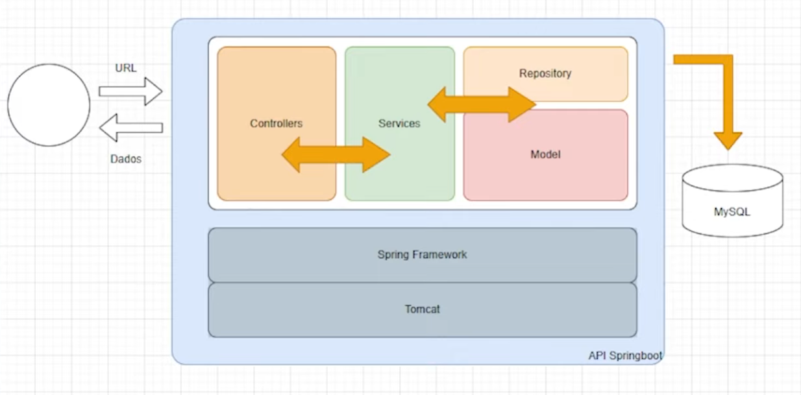
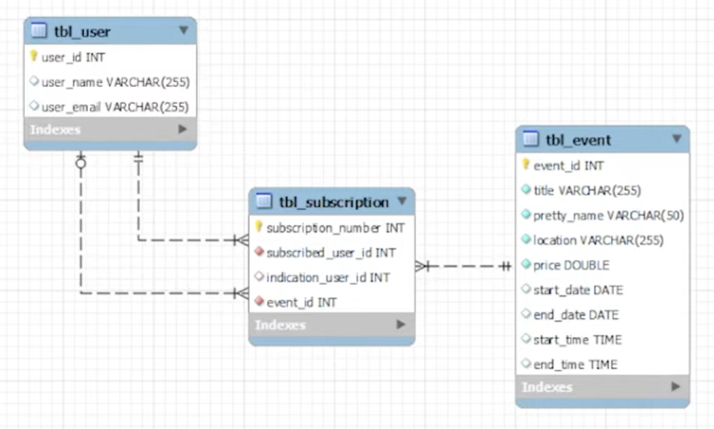
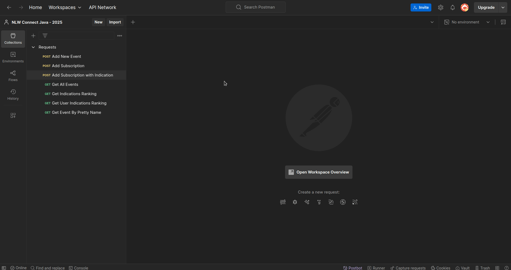

# NLW Connect 2025 - Java

## Descrição

Este projeto é uma aplicação back-end desenvolvida em Java utilizando o framework Spring Boot, com a estruturação do projeto desde a modelagem dos dados até a implementação das funcionalidades principais. A aplicação permite o gerenciamento de eventos e inscrições, oferecendo funcionalidades para criar e listar eventos, além de gerenciar inscrições de usuários. O desenvolvimento foi realizado com Maven, utilizando API Rest para comunicação e integração com o banco de dados MySQL por meio de JPA e JDBC. A manipulação de dados foi feita com records, e o sistema inclui uma funcionalidade de indicações, com ranking dos usuários que mais convidaram pessoas para o evento.

## Funcionalidades do projeto

- Cadastrar novos eventos;
- Listar todos os eventos;
- Buscar eventos pelo nome amigável (pretty name);
- Criar novas inscrições para eventos;
- Gerar ranking de inscrições por evento.

## Estrutura do Projeto

```
src/
  main/
    java/
      br/
        com/
          nlw/
            events/
              controller/
              dto/
              exception/
              model/
              repository/
              service/
    resources/
      application.properties
  test/
    java/
      br/
        com/
          nlw/
            events/
```



## Dependências

- Spring Boot Starter Data JPA;
- Spring Boot Starter Web;
- MySQL Connector;
- Spring Boot DevTools;
- Spring Boot Starter Test.

## Como rodar o projeto

1. Clone o repositório:

   ```sh
   git clone <URL_DO_REPOSITORIO>
   cd events
   ```

2. Configure o banco de dados no arquivo application.properties:

   ```properties
   spring.datasource.username = <SEU_USUARIO>
   spring.datasource.password = <SUA_SENHA>
   spring.datasource.url = jdbc:mysql://localhost:3306/db_events
   ```

3. Execute o projeto:

   ```sh
   ./mvnw spring-boot:run
   ```

4. Acesse a aplicação em `http://localhost:8080`.

## Endpoints

- `POST /events`: adiciona um novo evento;
- `GET /events`: lista todos os eventos;
- `GET /events/{prettyName}`: busca evento pelo nome amigável;
- `POST /subscription/{prettyName}`: cria uma nova inscrição para um evento;
- `GET /subscription/{prettyName}/ranking`: gera ranking de inscrições por evento.

## Estrutura do Banco de Dados

- Tabela `tbl_event`: armazena informações dos eventos;
- Tabela `tbl_user`: armazena informações dos usuários;
- Tabela `tbl_subscription`: armazena informações das inscrições.



## Gif das requisições do projeto



## Arquivos auxiliares

- [db_events.txt](db_events.txt);
- [docker-compose.yml](docker-compose.yml);
- [inscritos.json](inscritos.json).
